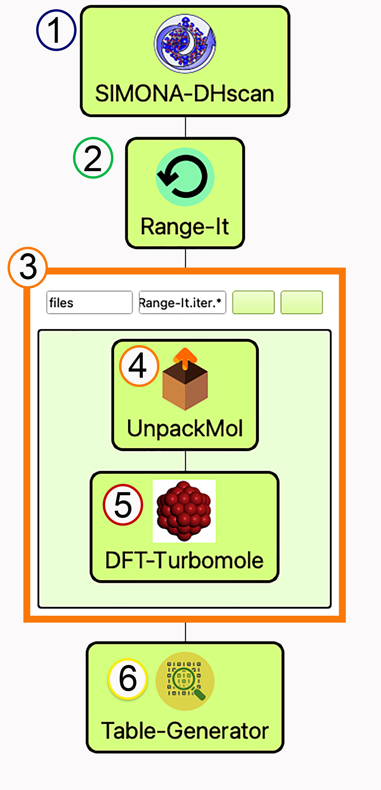
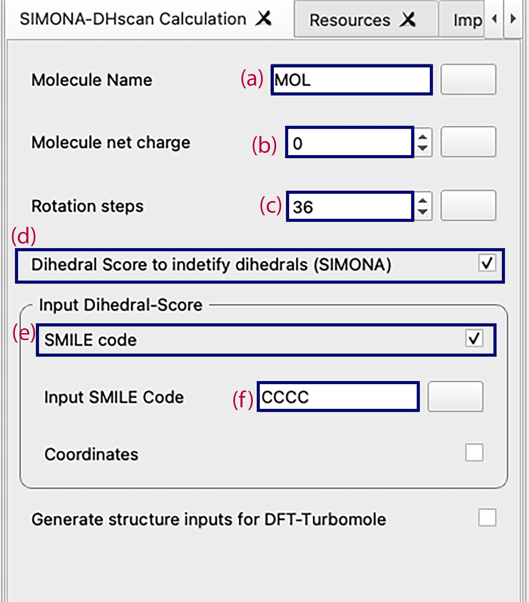
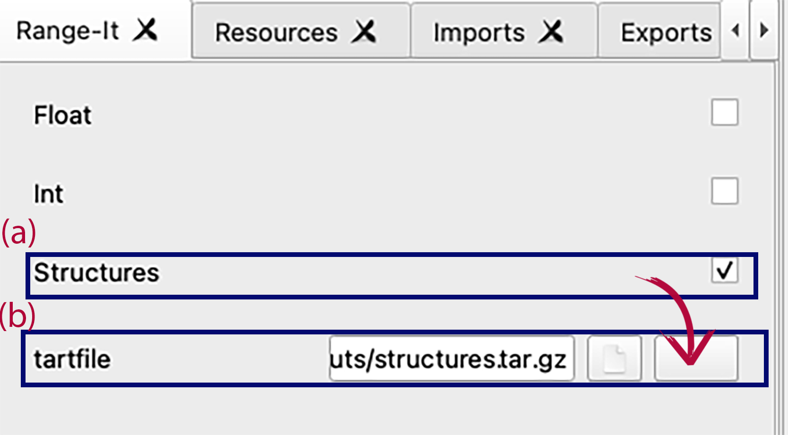
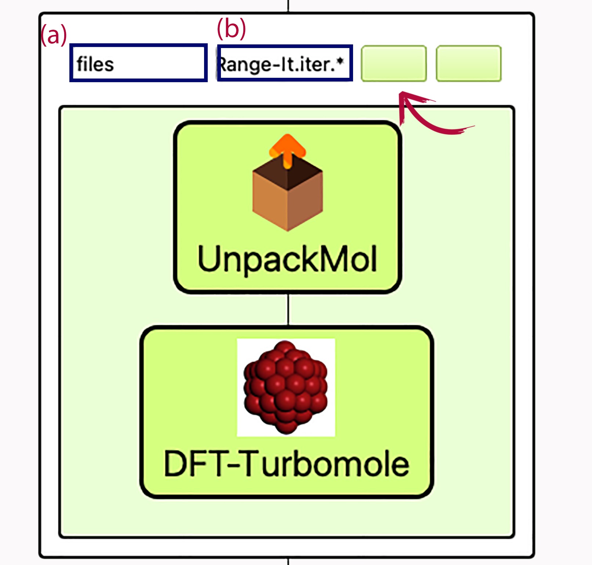
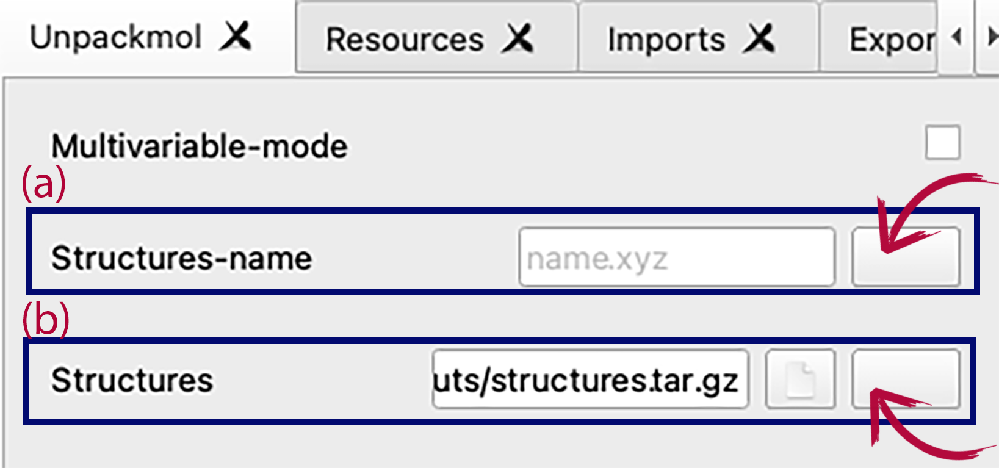
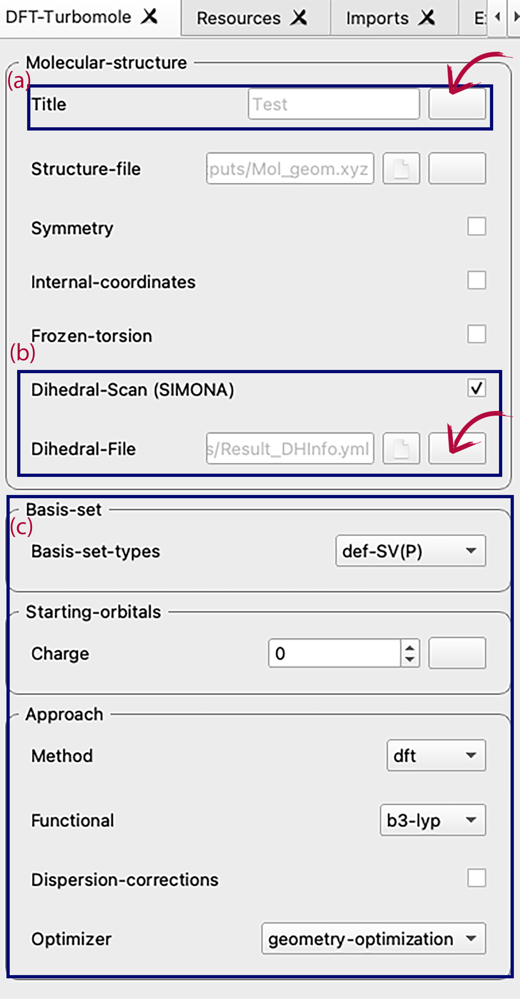
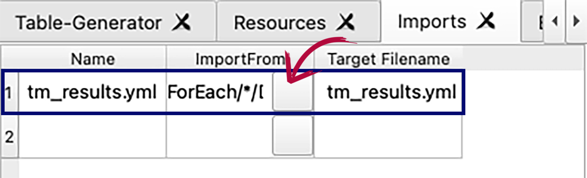
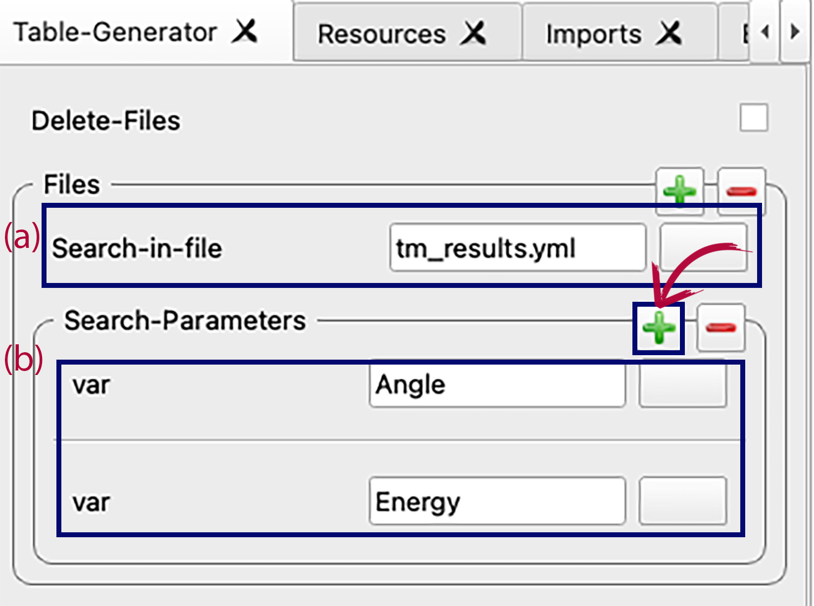

When publishing results obtained with Dihedral-Scan Workflow, please consider citing it.[](https://zenodo.org/badge/latestdoi/459086505)

# Dihedral-Scan
In this workflow, we use SimStack framework to perform dihedral scan calculations to determine global and local energy configuration with a molecule of interest.

### In this workflow, we will be able to:
```
1. Generate a molecule with SMILE code or use coordinates with PDB format.
2. Make a scan screening calculation of all possible dihedrals using SIMONA.
3. Obtain the coordinates for the best scored dihedral and the atom identity of the torsion.
4. With the support of Unpack and Range-It, we will Calculate the dihedral scan with DFT-Turbomole.
5. Obtain the dihedral profile using Table-Generator and Plot-Figure WaNos.
```

## Programs and Python Setup

To get this workflow up running on your available computational resources, make sure to have the below programs and libraries installed on Python 3.6 or newer. We recomend to use Anaconda for the use of all the python packages.

```
1. SIMONA (local compilation)
2. AmberTools and AcPype.
3. Gromacs.
4. Pymol (API).
5. Turbomole.
6. glob, tarfile, numpy, matplotlib, csv, pandas.  
```

## Dihedral Scan workflow

Dihedral-Workflow can be perform under 6 main steps (Figure 1).

<p align="center">

</p>

**Fig 1** _Scheme of Dihedral-Scan workflow and it main steps._

Each step is detailed as follow:

### Step 1: **_SIMONA-DHscan_** [](https://zenodo.org/badge/latestdoi/459555048)


To perform the dihedral screening scan implemented in this WaNo and SIMONA, first drag SIMONA-DHscan WaNo to the workflow area and provide the following inputs (Figure 2):

<p align="center">

</p>

**Fig 2** _Manual inputs required for SIMONA-DHscan WaNo._

a) Molecule Name: We highly recomend to give a name to the molecule of interest. We recomend to use only alphabetic names. They can be Capital or lower case. The firts three main characters will be used to provide names to the calculation files.

b) Molecule net charge: Since a parametrization step is required and partial charges will be calculated it is mandatory to provide the right net charge of the molecule of interest.

c) Rotation steps: total of number of steps will be used for the 360 degree rotation. For example, if steps = 36, steps of 10 degrees will be taken.

d) Dihedral Score to identify dihedrals (SIMONA): This field is required to select the source of the structure input for the dihedral scan. Another option  is "Generate structure inputs for DFT-Turbomole" (it only takes a PDB coordinates and generates structures for a desired dihedral id).

e)Input Dihedral Score - SIMILE code: Mandatory input. Here the user must provide the source of the molecule of interest. If SMILE code is chosen, SIMONA-DHscan will create the coordinates using General Amber Force Field library to build it. On the other hand, the user can provide PDB coordinates as initial structure.

### Step 2:  **_Range-it_**

Since many coordinates were generated by SIMONA-DHscan, the support of Range-It is necesary to provide a iterable variable over all the structures that will be calculated with the DFT-Turbomole WaNo.

The following inputs must be provided (Figure 3):

<p align="center">

</p>

**Fig 3** _a) Kind of inputs: "Structures". b) Directory path of the structure inputs._

SIMONA-DHscan automatically will generate a compress file collecting all the structures for the best scored torsion angle. To access this file with Range-it, drag Range-It into the workflow area and open the settings box to click on "Structures" (a) and then click in the first box form the right side (b, with red arrow) and look for the following path:

```
SIMONA-DHscan/outputs/structures.tar.gz
```

This way, Range-It will look for "Structures.tar.gz" when SIMONA-DHscan finish its work.

### Step 3:  **_ForEach loop_**

From the list "Controls" from the left side of SimStack, drag to the workflow "ForEach", then a box will appear with two fields ((a) and (b) in Figure 4).

<p align="center">

</p>

**Fig 4** _a) Name of variable in the ForEach loop. b) Name of all the variables in the loop ._


ForEach loop will allow the workflow to perform an accion using paralell resources over an interation value we will provide with Range-it. To use it for the dihedral scan worklfow it is necessary to provide the following inputs:

First drag inside the ForEach loop the Wanos UnpackMol and DFT-Turbomole (details in the next secction).

Then, in the first blank box from the left side we have to provide a name for the variables, in this case we will use:
```
files
```

And in the second box we will tell to ForEach all the values (list of variables) will be used in the loo that comes from Range-it.
```
Range-It.iter.*
```

:star2: hint: ForEach loop works like a "for" loop. Logical syntax : for "files" in "list of variables".

### Step 4: **_UnpackMol_**

Since we used Range-it and ForEach to manage a variable name and perform an iterative loop, we still don't get any file from SIMONA-DHscan. UnpackMol will use the variable name from Range-It and inside the ForEach loop it will extract the coordinate file needed to be used in DFT-Turbomole.

<p align="center">

</p>

**Fig 5** _Manual inputs required for SIMONA-DHscan WaNo._

We need to provide the following input (Figure 5):

a) Structures-name: Open the first box from the right and add the following to provide the right name to the coordinates.

```
ForEach.${files_ITER}.UnpackMol.Structures-name

```
b) Structure: provides the path to the source of the structures.

```
SIMONA-DHscan/outputs/structures.tar.gz
```


### Step 5: **_DFT-Turbomole_**


DFT-Turbomole WaNo will perform the high level calculation for our torsion scan. As follow we will provide the source of the coordinates and additional input to perform the calculation as it is shown in Figure 6.

<p align="center">

</p>

**Fig 6** _Manual inputs required for SIMONA-DHscan WaNo._


a) Title: Here we provide the name of the calculation. Since are many calculations we will use the names provided in our iterative arrangement.

```
ForEach.${files_ITER}.UnpackMol.Structures-name
```
 b) Structure-file: To perform the quantum calculation we will use the coordinates provided from SIMONA-DHscan, but stracted by UnpackMol.

```
ForEach/${files_ITER}/UnpackMol/outputs/Mol_geom.xyz
```

c) Dihedral-Scan (SIMONA) - Dihedral-File: Since the identity of the torsion was determined by SIMONA-DHscan, the information is provided given the path to the following output file.

```
SIMONA-DHscan/outputs/Result_DHInfo.yml
```

d) Quantum calculation set up:

This field is mandatory, but it is up to the user. According to the complexity of the molecule of interest and its nature. The following fields must be provided:
- Basis-set-types
- Charge
- Method, functional dispersion-correction, 
- Optimizer (It must be geometry-optimization)

### Step 6: **_Table-Generator_**

To obtain all the total energy and angle values from every single quantum calculation performed, we will use Table-Generator WaNo.

First, it is necessary to provide the path of the files were the information is storage in each single calculation directory.

<p align="center">

</p>

**Fig 7** _Manual inputs required for SIMONA-DHscan WaNo._

For that we have to select the tab "Imports" (Figure 7) and  in "ImportForm" add:

```
ForEach/*/DFT-Turbomole/outputs/tm_results.yml
```

Finally, we come back to the main settings in the "Table-Generator" tab (Figure 8) and we add the following;

<p align="center">

</p>

**Fig 8** _Manual inputs required for SIMONA-DHscan WaNo._

a) Search-in-file:
```
tm_results.yml
```

b) Search-Parameters: By default one parameter (var) is visible, since we need "Energy" and "Angles", we add an additional field. Then we add the names of "Angle" and "Energy"

### 7. Save and Run Workflow.

Once all the settings and parameters are provided, save the workflow (mandatory), then make it RUN :smiley:! :fire: .
