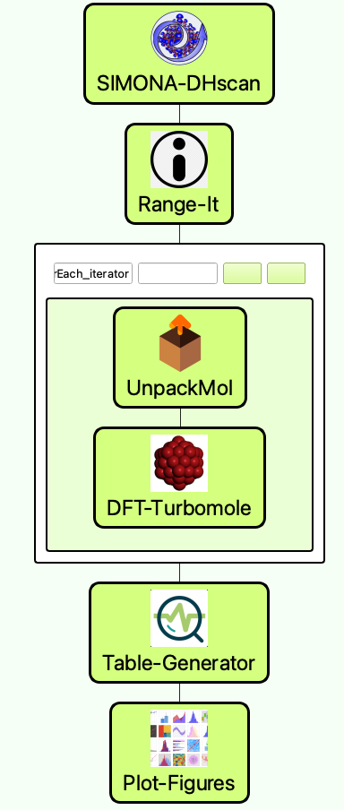

# Dihedral-Scan
In this workflow, we use SimStack framework to perform dihedral scan calculations to determine global and local energy configuration with a molecule of interest.

### In this workflow, we will be able to:
```
1. Generate a molecule with SMILE code or use coordinates with PDB format.
2. Make a scan screening calculation of all possible dihedrals using SIMONA.
3. Obtain the coordinates for the best scored dihedral and the atom identity of the torsion.
4. Calculate the dihedral scan with DFT-Turbomole
5. Obtain the dihedral profile using Table-Generator and Plot-Figure WaNos.
```


## Dihedral Scan workflow with **_ForEach_** loop control



**Fig 1** _Scheme of the workflow ._


## 1. Python Setup

## 2. SIMONA-DHscan inputs

## 3. Unpack and for **_ForEach_** loop arrangement 

## 4. DFT-Turbomole inputs

## 5. Table-Generator inputs

## 6. Plot-Figure inputs
